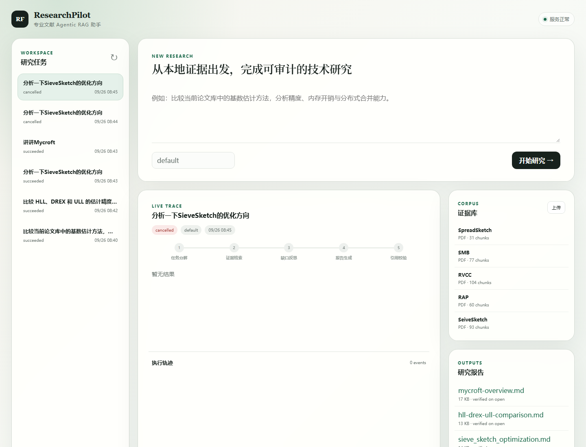
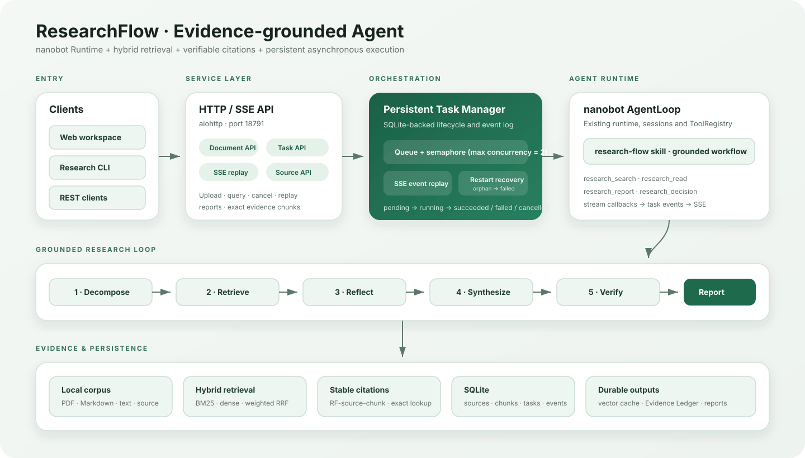

<div align="center">
  <h1>ResearchPilot</h1>
  <p><strong>专业文献 Agentic RAG 助手</strong></p>
  <p>
    <a href="https://github.com/nguyenmailan535-dotcom/ResearchPilot/actions/workflows/ci.yml"></a>
    
    
    
    
  </p>
</div>

ResearchPilot 面向论文与技术文档研究场景，将 Agent 多轮工具调用、长期记忆、混合检索、
证据引用、异步任务与效果评测组织成一条完整的 Agentic RAG 工作流。系统既可以通过 CLI
交互，也可以使用 FastAPI 与 Web 工作台执行长任务并实时观察 Agent 轨迹。

[系统设计](./docs/RESEARCH_FLOW.md) · [HTTP/SSE API](./docs/RESEARCH_API.md) ·
[评测数据](./benchmarks/researchflow/README.md) · [简历与面试材料](./docs/RESUME_PROJECT.md)



## 核心能力

### Agent Harness

- 通过 `ContextBuilder → AgentRunner → ToolRegistry → Tool Execution` 组织上下文构建、模型推理、工具选择、Observation 回填与多轮迭代。
- 统一装配 System Prompt、会话历史、Skills、Memory、Tool Schema 和用户请求，并通过 Tool Result 截断与 Skills 渐进披露控制上下文长度。
- 使用 `HISTORY.md + MEMORY.md` 保存分层记忆；Memory Consolidation 对历史会话进行摘要压缩，并允许 Agent 主动沉淀长期信息。
- 复杂问题可以拆分为 2-3 个只读研究子任务并发执行，由主 Agent 负责冲突处理、证据校验和最终综合。

### 文档解析与索引

- 使用 Unstructured 解析 PDF，保留标题、正文元素、页码、章节和来源元数据。
- 默认采用 `768/120` 的页面/章节感知语义切分，避免跨页、跨章节产生语义破碎的 Chunk。
- 使用 BGE-M3 生成 1024 维 Dense Embedding，将 Chunk 与 Metadata 同步至 Milvus。
- Dense 路径采用 HNSW，Sparse 路径使用 Milvus BM25 Function；SQLite 保存语料元数据、任务、事件和 Evidence Ledger。

### 混合检索与动态路由

- 支持 `bm25`、`vector`、`hybrid` 和 `reflected_hybrid` 四种检索策略。
- BM25 与 Dense 双路召回后通过加权 RRF 融合，支持来源、页码区间、章节和元素类型过滤，默认返回 Top-5 Evidence。
- 低置信度结果触发 Query Rewrite 与二次检索；本地证据仍不足且用户明确允许时，降级至 Tavily Web Search。
- 可选 Cross-Encoder Reranker 用于精度优先场景；默认关闭，避免 CPU 部署下显著增加 P95 延迟。

### Evidence Grounding

- 摄取时为证据块生成稳定的 `RF-<source>-<chunk>` Citation ID。
- 回答中的引用可以回溯至论文标题、页码、章节和原始文本。
- 校验引用是否存在、引用覆盖率以及 Claim-Evidence 支持关系，减少无依据生成。
- Evidence Ledger 使用版本化记录保存带引用的研究结论和项目决策。

### 异步任务与实时轨迹

- FastAPI 提供任务创建、状态查询、取消、语料上传和证据读取接口。
- SQLite 持久化任务状态和事件；服务重启时将中断任务恢复标记为失败，避免永久停留在运行态。
- SSE 支持断线后根据事件序号恢复 Agent 执行轨迹。
- 使用 `asyncio.Semaphore` 控制进程级并发，并为 Agent 迭代、工具调用和任务执行配置独立超时边界。

## 工作流

```text
用户问题
  ↓
任务分解与上下文组装
  ↓
本地混合检索（BM25 + BGE-M3 + RRF + Metadata Filter）
  ↓
证据缺口分析 ──低置信度──> Query Rewrite / 二次检索 / 可选 Web Search
  ↓
精确读取证据与多轮工具调用
  ↓
生成研究报告
  ↓
引用有效性与 Claim-Evidence 校验
  ↓
保存报告和 Evidence Ledger
```



## 评测结果

仓库保存了 40 条检索回归集、16 条端到端问答集以及对应原始结果，避免只展示主观 Demo。

| 指标 | BM25 | Hybrid Retrieval | 变化 |
| --- | ---: | ---: | ---: |
| Recall@5 | 0.4625 | 0.7125 | +54.1% |
| MRR@5 | 0.3858 | 0.4654 | +20.6% |

| 端到端指标 | 结果 |
| --- | ---: |
| 任务完成率 | 100% |
| 引用有效率 | 100% |
| RAGAS Faithfulness | 0.8773 |
| RAGAS Answer Relevancy | 0.9134 |

原始评测文件位于 [`benchmarks/researchflow/results`](./benchmarks/researchflow/results)。不同模型、
索引版本和硬件产生的结果不会混用；完整口径见
[`benchmarks/researchflow/README.md`](./benchmarks/researchflow/README.md)。

## 快速开始

### 1. 安装依赖

推荐使用 [uv](https://docs.astral.sh/uv/)：

```bash
git clone https://github.com/nguyenmailan535-dotcom/ResearchPilot.git
cd ResearchPilot
uv sync --all-extras
```

安装后可以使用 `researchpilot` 命令；为兼容现有脚本，同时保留 `nanobot` 命令别名。

### 2. 配置模型与检索服务

```bash
cp .env.example .env
```

至少需要配置模型 API；生产检索路径还需要可访问的 Milvus。默认 Dense 模型为
`BAAI/bge-m3`。Tavily 仅用于用户允许的联网降级，不配置时不会影响本地论文研究。

### 3. 摄取论文并同步索引

```bash
researchpilot research ingest ./papers --workspace ./research-workspace
researchpilot research sync-index --workspace ./research-workspace
```

### 4. 检查检索结果

```bash
researchpilot research search \
  "比较当前论文库中的基数估计方法" \
  --workspace ./research-workspace \
  --strategy hybrid
```

### 5. 启动 Agent 或 Web 工作台

```bash
# CLI Agent
researchpilot agent --workspace ./research-workspace

# FastAPI + Web + SSE
researchpilot serve \
  --host 127.0.0.1 \
  --port 18791 \
  --workspace ./research-workspace
```

浏览器访问 `http://127.0.0.1:18791`。

## Docker Compose

```bash
docker compose -f docker-compose.research.yml up -d --build
docker compose -f docker-compose.research.yml exec researchflow \
  researchpilot research ingest /data/papers --workspace /data/workspace
docker compose -f docker-compose.research.yml exec researchflow \
  researchpilot research sync-index --workspace /data/workspace
```

论文目录通过 `./papers` 只读挂载，运行数据保存到 `./workspace`，两者默认不提交 Git。

## 常用命令

```bash
# 四种检索策略对比
researchpilot research benchmark \
  ./benchmarks/researchflow/cardinality_sketch_40_bge_m3.jsonl \
  --workspace ./research-workspace

# 调整 RRF 权重
researchpilot research tune-rrf \
  ./benchmarks/researchflow/cardinality_sketch_40_bge_m3.jsonl \
  --workspace ./research-workspace

# 端到端评测
researchpilot research e2e-evaluate \
  ./benchmarks/researchflow/cardinality_e2e_holdout_16_bge_m3.jsonl \
  --workspace ./research-workspace

# RAGAS 评测
researchpilot research ragas-evaluate \
  ./research-workspace/research/evaluations/e2e-result.json \
  --workspace ./research-workspace
```

具体参数以 `researchpilot research --help` 为准。

## 测试与 CI

```bash
uv run ruff check \
  nanobot/api nanobot/research nanobot/agent/tools/research.py \
  tests/api tests/research tests/tools/test_research_tools.py

uv run pytest \
  tests/api tests/research tests/tools/test_research_tools.py \
  tests/test_openai_api.py
```

GitHub Actions 会在 Python 3.11、3.12 和 3.13 上执行检查，同时构建 Docker 镜像。

## 目录结构

```text
nanobot/
├── agent/                 # Agent Loop、上下文、工具注册、记忆与子任务
├── api/                   # FastAPI、异步任务与 SSE
├── research/              # 解析、索引、检索、引用、评测与任务存储
├── skills/research-flow/  # 研究工作流 Skill
└── web/                   # 零构建 Web 工作台

benchmarks/researchflow/   # 评测集、原始结果与审计记录
docs/                      # 架构、API、简历与面试材料
```

## License

本项目按照 [MIT License](./LICENSE) 发布。
